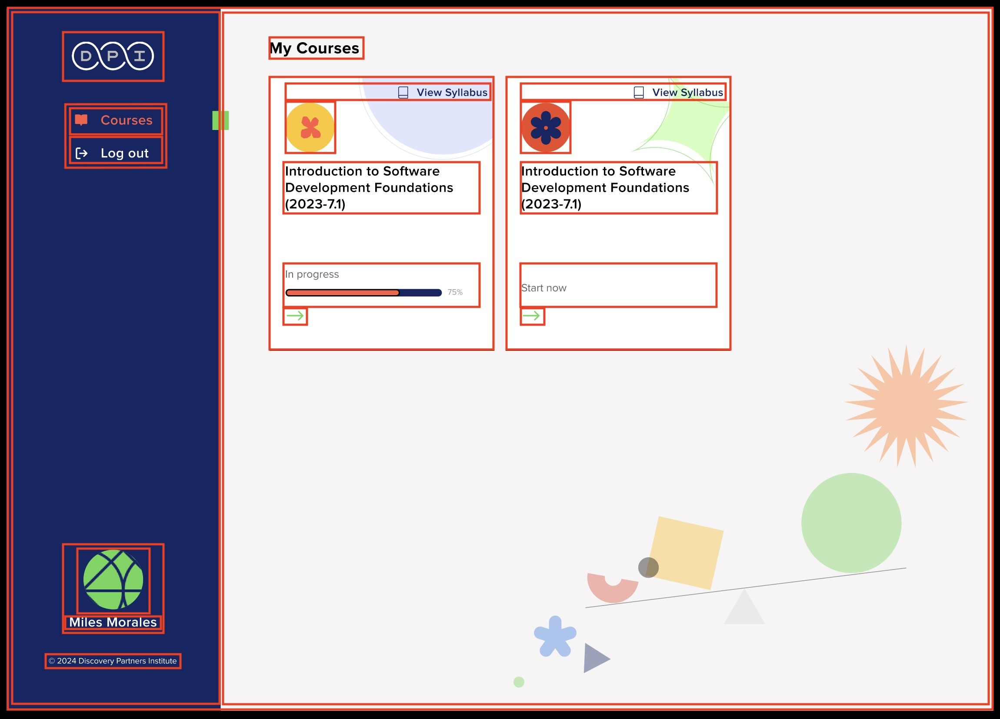

# Project Overview

Our task is to develop a web page based on a provided design.

*Provided design - Larger screen and smaller screen*

# Preliminary work

## Identifying the various elements

## Color palette
We used a color picker to get the RGB values for the colors showed by the client in the mockup. 

We may need to confirm the exact values with their color palette.

- DPI Primary: rgb(23, 38, 98) 
- DPI Accent: rgb(130, 213, 102)
- Custom Red: rgb(236, 101, 78)

## Dimensions
- Larger screen
  - Overall: 2300px x 1654px
  - Navbar: ~ 490px (or 21% of the width)
  - Cards: 510px x 630px

- Smaller screen
  - Overall: 1236px x 1644px
  - Navbar: ~ 370px (or 30% of the width)
  - Cards: 360px x 470px

## Interactivity 
- Active nav link has a different color
- Hover for nav links
- Hover for course arrow (+ when clicked?)

# Approach
1. Our preliminary work allows us to break down the assignment into smaller manageable parts. The parts and subparts are:
  - sidebar
    - logo
    - navigation
    - profile
    - footer
  - main collection of cards
    - title
    - cards
  - individual cards
    - card header
    - card content
    - card footer
      - includes a progress bar
2. We compartimentalize as much as possible to make our code more readable and maintanable. This includes separating the style in its own stylesheet, declaring theme colors as variables, grouping the class selectors to match the parts mentioned previously as much as possible.
3. We tackled each part one by one and make sure it matches the target as closely as possible, for the larger and the smaller screens.

# Challenges faced
1. Trying not to think about all the possible cases. Client's requirements include two screenshots for two different, relatively large sizes. With our limited timed, the choice was made not to make it mobile responsive, for which it would probably be best to hide the sidebar, or make it a top navbar with a hamburger menu. A mobile version would probably also call for cutting down some images.
2. Finding the exact matching sans-serif font. We tried some online tool to find matching fonts but they were not 100% accurate. We ended up finding the best fit within the ones available natively for most browsers.
3. Missing assets: a few assets were missing. We used as close as possible replacements, but can easily replace them if the client provides us with their required files.
4. Nav links: some trouble aligning icons correctly. Looking closely at our code, it was coming from the mixed nature of the icons and the way they were shown (svg shown through an img tag vs svg shown with Font Awesome with a class). We fixed this by showing the svg file we have on hand as a CSS background image. This also made it easier to handle changing the icon for hover and active link.
5. Getting the current navigation link to show in red for both the text and its icon was challenging given the set up (switching from hollow to solid icon). We did this with a multiplication of CSS selectors, but it's hardly scalable. This is a point that can be improved later on.
6. Avoiding creating too many different and repetitive classes, especially when working on aligning items for the navbar. To do this, I switched to a class-based styling, similarly to Bootstrap.
7. Getting the various element to the right size for the different screen sizes, while keeping the code organized. The main breakpoint is declared at the very bottom of the CSS stylesheet. The variying font size is managed throughout the CSS stylesheet.
8. Getting the green rectangle functional. We only have one set of screenshots showing one static page, so we could assume this green rectangle is static. However, we may have reasons to believe it's dynamically showing the active navigation link since it is perfectly aligned with the "Course" navigation link. I was not familiar with "::after" but after a quick search and some tinkering I was able to reproduce it.

# Going further
1. Currently, the progression bar is static. It would need to be able to take a number from 0 to 100% from the backend and dynamically show the corresponding progression bar.
2. Discussing with the client the need or not for full mobile responsiveness.
3. Working on other pages (syllabus, etc.).
4. Adding more user interactions with JavaScript.
5. (Bridge the gap with the backend)